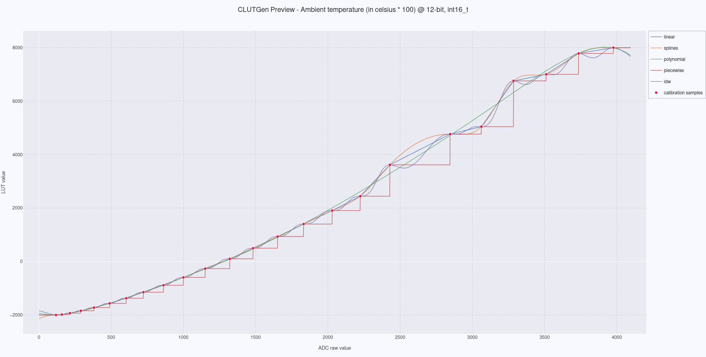
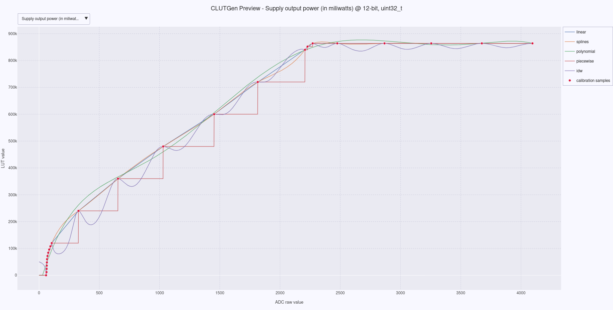
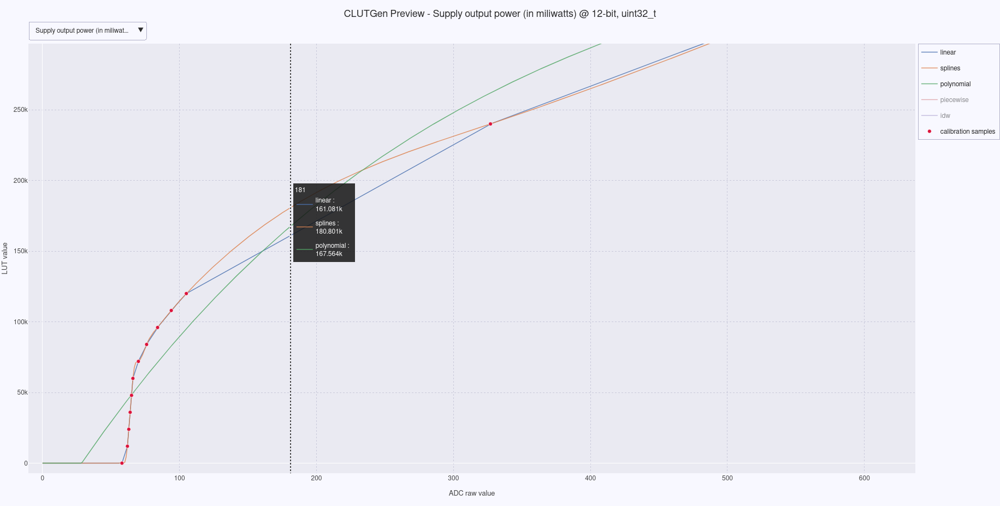

# CLUTGen — Zephyr Module

CLUTGen automates the creation of **Look-Up Tables** for embedded systems, converting raw ADC readings into calibrated physical units such as temperature, pressure, or distance.

This branch packages CLUTGen as a [Zephyr module](https://docs.zephyrproject.org/latest/develop/modules.html). LUT generation runs at configure time and produces a pair of `.c`/`.h` files that are automatically included in the application build.

> For standalone CLI usage, see the [cli tool](https://github.com/wkhadgar/clutgen).

---

## Requirements

* Python 3.10+
* `numpy`, `plotly`

---

## Integration

Declare the module in your workspace manifest:

```yaml
# west.yml
- name: clutgen
  url: https://github.com/wkhadgar/clutgen-zephyr
  revision: zephyr
  path: modules/clutgen
  submodules: true
```

Update your west workspace and install Python dependencies into the west venv:

```bash
west update
west packages pip --install
```

Then, in your application `CMakeLists.txt`, provide the paths to your calibration TOML files:

```cmake
clutgen_add_luts(
    TOMLS
        ${CMAKE_CURRENT_SOURCE_DIR}/calibration/temperature.toml
        ${CMAKE_CURRENT_SOURCE_DIR}/calibration/pressure.toml
)
```

`clutgen_add_luts` accepts the following parameters:

| Parameter | Required | Default | Description |
| :--- | :--- | :--- | :--- |
| `TOMLS` | Yes | — | One or more paths to `.toml` calibration config files |
| `NAME` | No | `lookup_tables` | Base name for the generated `.c`/`.h` files |
| `TARGET` | No | `app` | CMake target to attach the generated sources to |

**Example with all parameters:**

```cmake
clutgen_add_luts(
    NAME sensor_luts
    TARGET app
    TOMLS
        ${CMAKE_CURRENT_SOURCE_DIR}/calibration/temperature.toml
        ${CMAKE_CURRENT_SOURCE_DIR}/calibration/pressure.toml
)
```

LUT generation runs automatically when CMake configures the project. The generated files are placed in the build directory and linked into the application automatically.

Generated LUTs are accessible through the output header:

```c
#include "lookup_tables.h"  /* or your custom NAME.h */
```

Each configured sensor produces an array named `<n>_lut`, where `n` is the `name` field defined in its TOML:

```c
int val = temp_sensor_lut[adc_reading];
```


---

## Preview

```bash
west build -t clutgen_plot
```

> [!NOTE]
> If the build target is not available, make sure the project `CMakeLists.txt` is calling `clutgen_add_luts`, and cmake has been loaded correctly afterwards.

Opens an interactive figure in the browser showing all interpolation methods overlaid for each configured sensor. Use this to explore and compare methods before committing to one in the TOML.



When multiple sensors are configured, a dropdown allows switching between them:



You can focus on selected interpolations, zoom into regions, and hover over the plot to compare methods and make a confident choice:



---

## TOML Configuration

Each sensor requires a TOML configuration file and a CSV with its calibration samples.

**CSV schema:**
```csv
raw,calibration
```

Where `raw` is the ADC reading and `calibration` is the expected output value at that reading.

**TOML schema:**
```toml
name = "temp_sensor"                # C identifier — used as <n>_lut in generated code
description = "ambient temperature" # Used in Doxygen comments and plot titles
table_resolution_bits = 12          # ADC resolution in bits (e.g., 12 → 4096 entries)
lut_type = "int16_t"                # C type for the generated array

samples_csv = "./data/temperature_samples.csv"  # Relative to this file, or absolute

# Optional
interpolation = "polynomial"        # Overrides the default interpolation method for this LUT
```

### Interpolation Methods

| Value | Description |
| :--- | :--- |
| `linear` | Linear interpolation between calibration points. Default. |
| `splines` | Cubic spline interpolation; smooth transitions between points. |
| `polynomial` | Best-fit polynomial up to degree 7; prone to oscillation with sparse data. |
| `piecewise` | Zero-order hold; constant value between points, step-like output. |
| `idw` | Inverse Distance Weighting; weighted average of all known points. |
